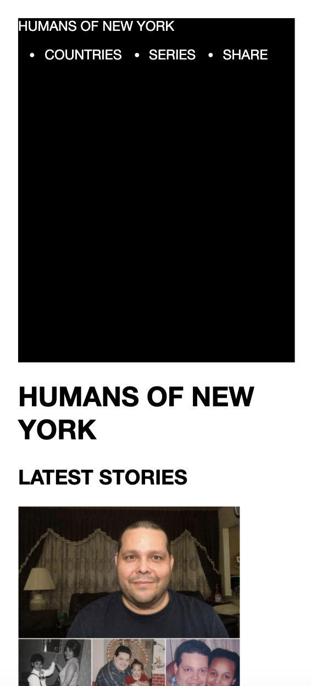
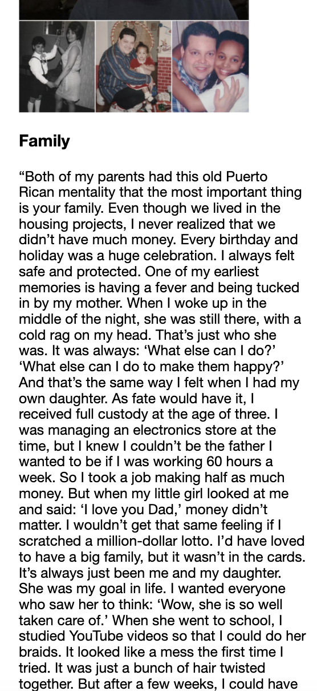
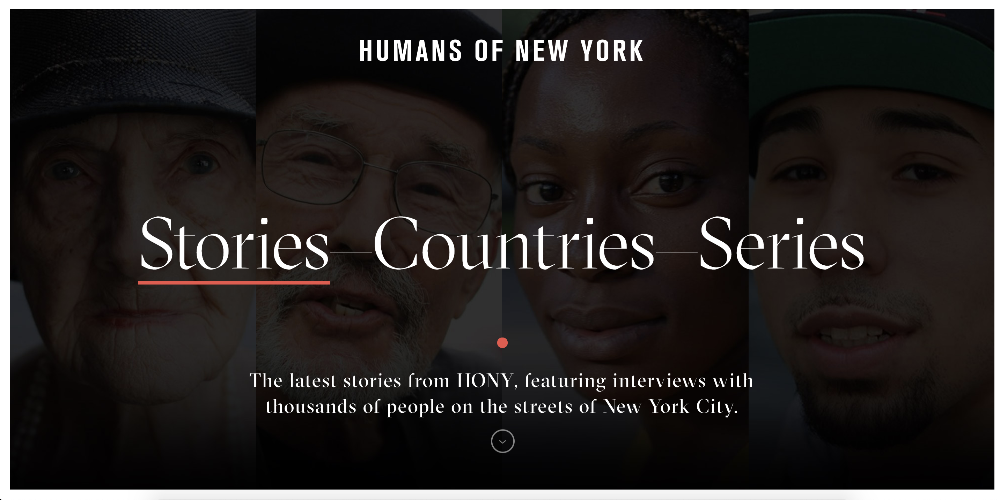
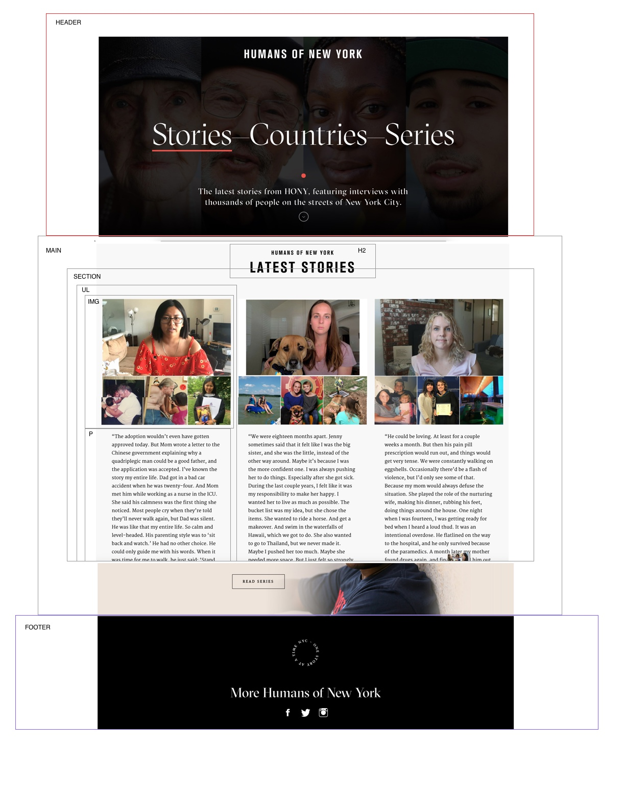

# Procesverslag
**Auteur:** Nadhira Alchatib

Markdown cheat cheet: [Hulp bij het schrijven van Markdown](https://github.com/adam-p/markdown-here/wiki/Markdown-Cheatsheet). Nb. de standaardstructuur en de spartaanse opmaak zijn helemaal prima. Het gaat om de inhoud van je procesverslag. Besteedt de tijd voor pracht en praal aan je website.

## Bronnenlijst
1. -bron 1-
2. -bron 2-
3. -...-

## Eindgesprek (week 7/8)

-dit ging goed & dit was lastig-

**Screenshot(s):**

-screenshot(s) van je eindresultaat-

## Voortgang 3 (week 6)

-same as voortgang 1-

## Voortgang 2 (week 5)

-same as voortgang 1-

## Voortgang 1 (week 3)

### Stand van zaken

-dit ging goed & dit was lastig-

De header klopt voor een groot deel voor een desktop scherm.

Voor een mobiele scherm is er op de echte website een hamburger menu.

Dit vind ik lastig om te maken.

**Screenshot(s):**

### Agenda voor meeting

-samen met je groepje opstellen-

### Verslag van meeting

-na afloop snel uitkomsten vastleggen-

## Intake (week 1)

**Je startniveau:** Kleur rood

**Je focus:** Ik ga focussen op de responsive plane

**Je opdracht:** Link naar de website: https://www.humansofnewyork.com/

**Screenshot(s):**

**Breakdown-schets(en):** 

