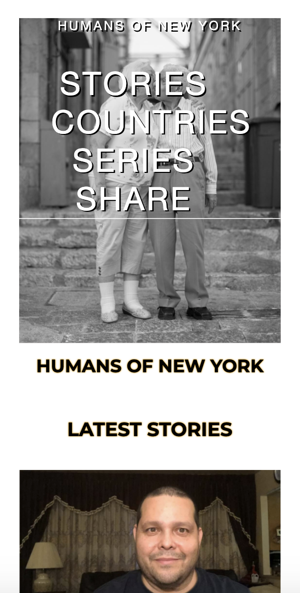
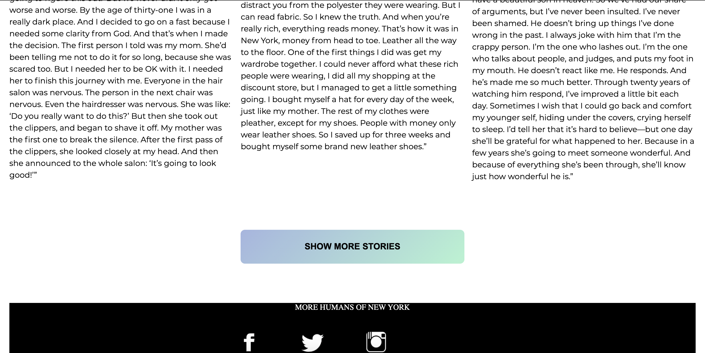
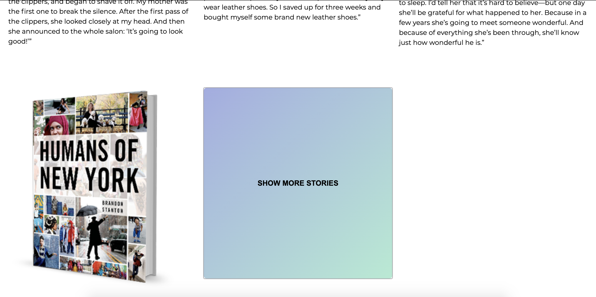
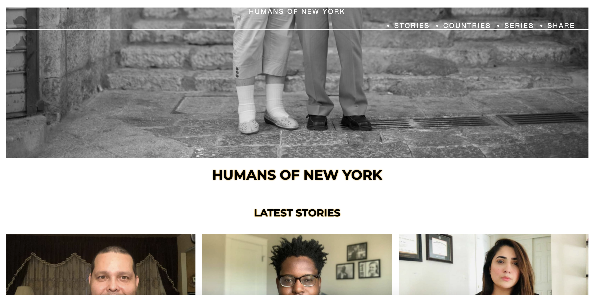
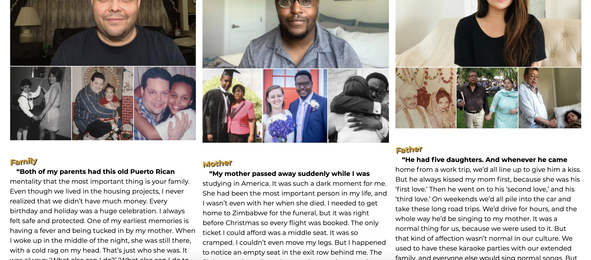
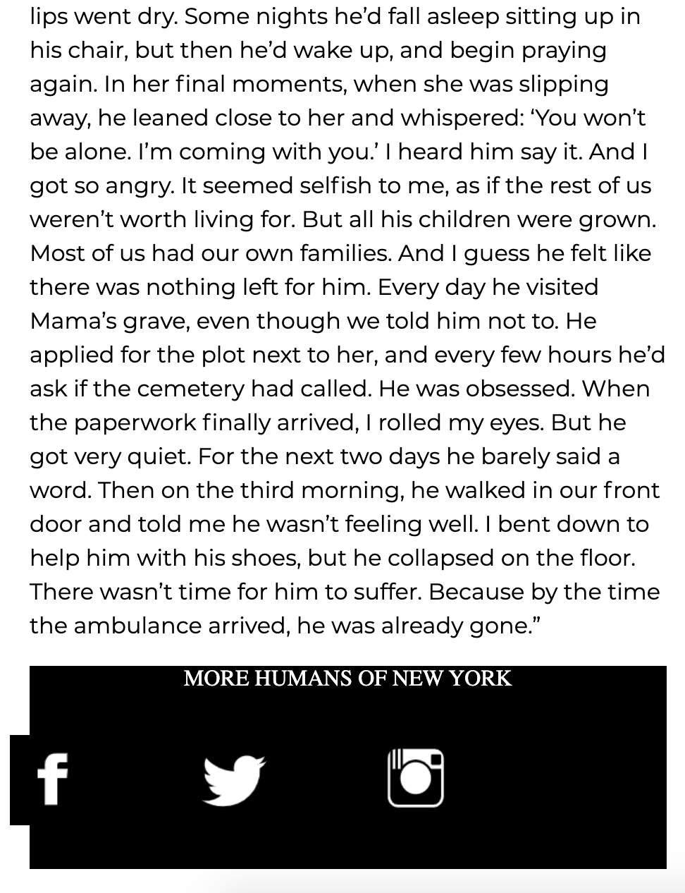

# Procesverslag
**Auteur:** Nadhira Alchatib

Markdown cheat cheet: [Hulp bij het schrijven van Markdown](https://github.com/adam-p/markdown-here/wiki/Markdown-Cheatsheet). Nb. de standaardstructuur en de spartaanse opmaak zijn helemaal prima. Het gaat om de inhoud van je procesverslag. Besteedt de tijd voor pracht en praal aan je website.

## Bronnenlijst
De mooie lessen van front-end development 

## Eindgesprek (week 7/8)

-dit ging goed & dit was lastig-

Goed: Header verandert op mobile screen

Wat ging minder goed: Tweede pagina nog niet aangemaakt

## Voortgang 3 (week 6)

-same as voortgang 1-

-dit ging goed & dit was lastig-

Goed: Animatie op de button kunnen maken. Wanneer je eroverheen hovert verandert hij van kleur en wanneer je erop klikt komt het boek van Humans of New York boek tevoorschijn. Dit heb ik met een aantal regels Javascript gerealiseerd. 

Wat ging minder goed: Tweede pagina nog niet aangemaakt

## Voortgang 2 (week 5)

-dit ging goed & dit was lastig-

Goed: Website is responsive

Wat ging minder goed: De footer met social media icoontjes 

## Voortgang 1 (week 3)

### Stand van zaken

-dit ging goed & dit was lastig-

De header klopt voor een groot deel voor een desktop scherm.

Voor een mobiele scherm is er op de echte website een hamburger menu.

Dit vind ik lastig om te maken.

**Screenshot(s):**

## Intake (week 1)

**Je startniveau:** Kleur rood

**Je focus:** Ik ga focussen op de responsive plane

**Je opdracht:** Link naar de website: https://www.humansofnewyork.com/

**Screenshot(s):**

**Breakdown-schets(en):** 

